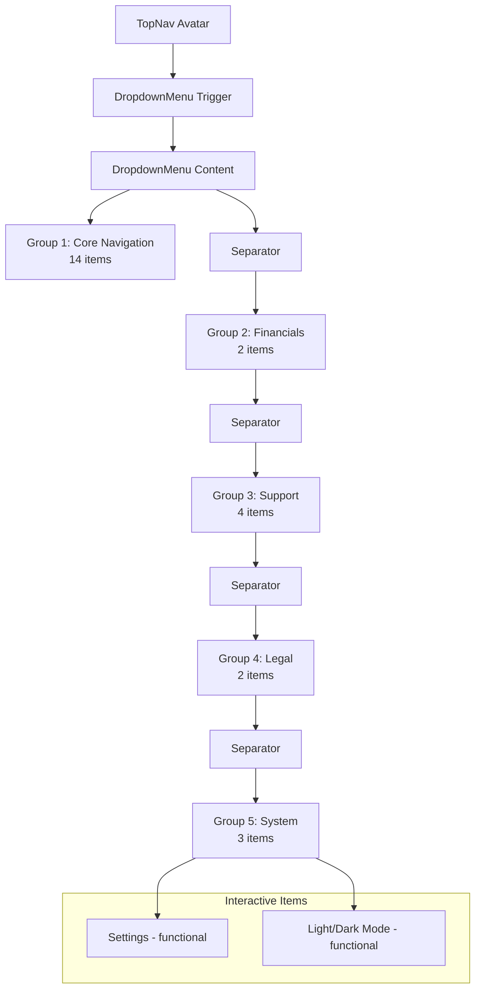

# ProfileDropdown Component Implementation Plan

## Overview
Create a new component `src/components/layout/ProfileDropdown.tsx` using Shadcn/UI's DropdownMenu primitives, triggered by the user's profile avatar in TopNav.tsx.

## Requirements
- **Trigger**: User's profile avatar (existing in TopNav.tsx)
- **Content**: 25 list items with exact grouping and Lucide React icons
- **Styling**: High-density dark mode theme (Background: #16212e, Border: #2a3948, Hover accent: #1da1f2)
- **Interactivity**: Only 'Settings' and 'Light/Dark Mode' are functional; all other items are non-clickable
- **Separators**: Between each of the 5 groups

## Component Structure

## Implementation Steps

### 1. Shadcn/UI Installation
- Install shadcn/ui package: `npx shadcn@latest init`
- Configure with existing tailwind.config.ts
- Add DropdownMenu component: `npx shadcn@latest add dropdown-menu`

### 2. ProfileDropdown Component Creation
- Create `src/components/layout/ProfileDropdown.tsx`
- Import necessary Lucide React icons
- Define 25 menu items with icon mapping
- Implement grouping with Separator components
- Apply styling: background, border, hover states
- Add disabled state for non-interactive items

### 3. Integration with TopNav
- Import ProfileDropdown into TopNav.tsx
- Replace existing avatar div with DropdownMenu trigger
- Ensure proper positioning and z-index

### 4. Interactivity Implementation
- Settings item: onClick handler (placeholder for now)
- Light/Dark Mode: Toggle functionality using existing theme system
- All other items: `pointer-events-none opacity-70`

### 5. Styling Details
- Background: `bg-[#16212e]` (matches card color)
- Border: `border border-[#2a3948]`
- Text color: `text-white` for normal, `text-[#1da1f2]` on hover
- Padding and spacing to match high-density design
- Rounded corners: `rounded-md`

## File Updates Required
1. `package.json` - Add shadcn/ui dependencies
2. `components.json` - Shadcn configuration (if not exists)
3. `src/components/layout/ProfileDropdown.tsx` - New component
4. `src/components/layout/TopNav.tsx` - Integration
5. `PROJECT_STRUCTURE.md` - Update component map
6. `project_log.md` - Log new feature

## Dependencies to Install
- `@radix-ui/react-dropdown-menu`
- `class-variance-authority`
- `clsx`
- `tailwind-merge`
- `lucide-react` (already installed)

## Success Criteria
- Dropdown opens when clicking avatar
- All 25 items displayed with correct icons and grouping
- Only Settings and Light/Dark Mode are clickable
- Styling matches dark theme with proper hover states
- No breaking changes to existing functionality